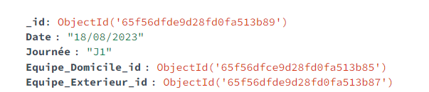

# Top 14 Database Creation

## <b>Overview</b>  

This project aims to create and update a database used to store Top 14 championship statistics about players and matches.

## <b> Motivation </b>

As a French supporter disappointed by the recent results of the national team (espacially during the world cup), I decided to create the biggest database I could create to confront the French head coach speech. Actually, the coach's belief at the beginning of his career was to gather the current most performing players.

As to know, France is composed of almost 68 million people and almost  the same amount of head coaches (or even more). That brings a lot of divergent opinions concerning the players to select on social networks. Men lie, not numbers would a lot a French people say. Let's dive a little bit into the truth of numbers !

## <b> Database Solution </b>

As the evolution of data within the sport field is really fast, I opted for a flexible NoSQL solution called MongoDB. This solution is hosted in the cloud by AWS and this solution is called MongoDB Atlas.

This database is fed by different websites referenced in the Sources section below.

This database is composed of 4 collections :
* match
* team_stats
* players
* player_stats

Here is an overview of the final structure of these collections in MongoDB : 

* match
  

  
* team_stats

  
* players
  

  
* player_stats

## <b> Sources </b>

I decided to scrap 3 websites that seemed accurate for me : 
* AllRugby ([link](https://www.allrugby.com/))
* LNR ([link](https://www.lnr.fr/))
* LGM ([link](https://lagrandemelee.midi-olympique.fr/))

All Rugby was used to create the general information about the player (Age, height, weight). It leads to the creation of the players collection in the MongoDB database.

LNR and LGM were used to create the other collections with more specific statistics taking into account the match.

## <b> Installation </b>

1. Clone the repository
2. Install dependencies with `pip install -r requirements.txt`
3. Configure settings in `.env` file (MongoDB Atlas and La Grande Mêlée accounts are required)
4. Run the application with `main.py` (in the etl_functions folder)

## <b> Contact </b>

📫 **amorlas65@gmail.com**

<h3 align="left">Connect with me:</h3>

